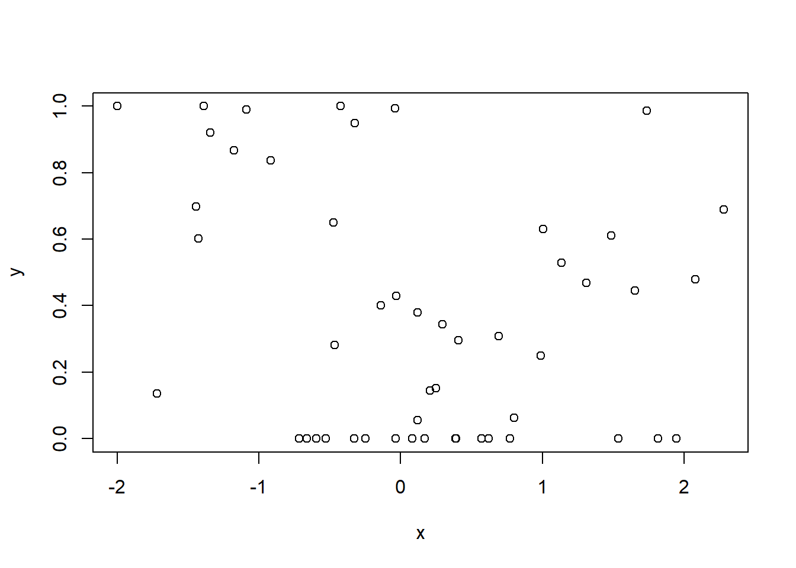

# Transforming posterior samples

## Binomial model
Let's first try something relatively easy: a binomial model with one random effect. We first generate data:

```r
library(brms)
set.seed(456)
N <- 50
Ni <- 10
x <- rnorm(N)
id <- sample(Ni,N,replace=TRUE)
id.f <- factor(id)
id.vals <- rnorm(Ni)
lin.y <- x + id.vals[id]
p.y <- plogis(lin.y)
y <- rbinom(N,1,p.y)
d <- data.frame(x=x,y=y,id=id.f)
```
And then proceed with the analysis:

```r
# 1. A bernoulli model with random effect
m1 <- brm(y~x+(1|id),family=bernoulli,
    warmup=1000,
    iter=2000,
    data=d,
    backend="cmdstanr",
    file="BRMS_bernoulli")

# data points for which we want predictions:
newdat <- data.frame(x=c(0.3,0.4),id='1')

# predictions on linear scale
m1.fit.lin <- fitted(m1,summary=FALSE,newdata=newdat,scale = 'linear',re_formula=NA)

#  define a function for getting estimate, se and 95% CI
sum.fun <- function(x) c(mu=mean(x),sd=sd(x),quantile(x,probs=c(0.025,0.975)))

# apply function for each row in newdat
t(apply(plogis(m1.fit.lin),2,sum.fun))
```

```
##             mu        sd      2.5%     97.5%
## [1,] 0.5661154 0.1563952 0.2212366 0.8396047
## [2,] 0.5958201 0.1562524 0.2413899 0.8598464
```

```r
# taking them directly from brms
fitted(m1,summary=TRUE,newdata=newdat,scale = 'response',re_formula=NA)
```

```
##       Estimate Est.Error      Q2.5     Q97.5
## [1,] 0.5661154 0.1563952 0.2212366 0.8396047
## [2,] 0.5958201 0.1562524 0.2413899 0.8598464
```
Fortunately, we see that both methods give identical estimates.

## Beta zero one inflated model
We now move to a slightly more complicated model: a beta regression with zero-one inflation. Assume we have a 40% chance of having inflation, which in turn in 80% of the cases implies a 0 and in 20% of the cases a 1.The following code simply simulates some data for our model to fit on:

```r
set.seed(456)
N <- 50
Ni <- 10
x <- rnorm(N)
id <- sample(Ni,N,replace=TRUE)
id.f <- factor(id)
id.vals <- rnorm(Ni)
lin.y <- x + id.vals[id]
p.y <- plogis(lin.y)
beta.var <- 0.04

# convert according to wikipedia
# maybe not the most professional source
# but didn't have time to rederive right now
# (nor to look up a better source)
shape.1 <- p.y*(p.y*(1-p.y)/beta.var -1)
shape.2 <- (1-p.y)*(p.y*(1-p.y)/beta.var -1)
y.std <- rbeta(N,1,shape.1,shape.2) 

# now add zero-one inflation:
y <- ifelse(runif(N)<0.4,as.numeric(runif(N)>0.8),y.std)
d <- data.frame(x=x,y=y,id=id.f)

# not too involved plot
plot(x,y)
```


Now we move to the analysis, first we are naive and we simply try the logistic transformation of the predictions:

```r
# 2. A beta zero one inflated model with random effect
m2 <- brm(y~x+(1|id),family=zero_one_inflated_beta,
    warmup=1000,
    iter=2000,
    data=d,
    backend="cmdstanr",
    file="BRMS_beta_zero_one")

# data points for which we want predictions:
newdat <- data.frame(x=c(0.3,0.4),id='1')

# predictions on linear scale
m2.fit.lin <- fitted(m2,summary=FALSE,newdata=newdat,scale = 'linear',re_formula=NA)

#  define a function for getting estimate, se and 95% CI
sum.fun <- function(x) c(mu=mean(x),sd=sd(x),quantile(x,probs=c(0.025,0.975)))

# apply function for each row in newdat
t(apply(plogis(m2.fit.lin),2,sum.fun))
```

```
##             mu         sd      2.5%     97.5%
## [1,] 0.5763428 0.08192093 0.4108652 0.7336134
## [2,] 0.5653001 0.08322229 0.3990678 0.7266214
```

```r
# taking them directly from brms
fitted(m2,summary=TRUE,newdata=newdat,scale = 'response',re_formula=NA)
```

```
##       Estimate  Est.Error      Q2.5     Q97.5
## [1,] 0.4103261 0.06361266 0.2858994 0.5397669
## [2,] 0.4035142 0.06396549 0.2802933 0.5333942
```
Now, the two are different, simply because we have not applied the zero one inflation. Let us now try to extract these values:

```r
# extract chances of zero one inflation and conditional chance of one from the model:
p.zoi <- as_draws_array(m2,variable = c('zoi'))
p.coi <- as_draws_array(m2,variable = c('coi'))

#  define a function for getting estimate, se and 95% CI
sum.fun.zoi <- function(x){
  x.corrected <- x*(1-p.zoi) + p.zoi*p.coi 
  c(mu=mean(x.corrected),sd=sd(x.corrected),quantile(x.corrected,probs=c(0.025,0.975)))
}
  
# apply function for each row in newdat
t(apply(plogis(m2.fit.lin),2,sum.fun.zoi))
```

```
##             mu         sd      2.5%     97.5%
## [1,] 0.4103261 0.06361266 0.2858994 0.5397669
## [2,] 0.4035142 0.06396549 0.2802933 0.5333942
```

```r
# taking them directly from brms
fitted(m2,summary=TRUE,newdata=newdat,scale = 'response',re_formula=NA)
```

```
##       Estimate  Est.Error      Q2.5     Q97.5
## [1,] 0.4103261 0.06361266 0.2858994 0.5397669
## [2,] 0.4035142 0.06396549 0.2802933 0.5333942
```
And now they are identical indeed, as expected!
