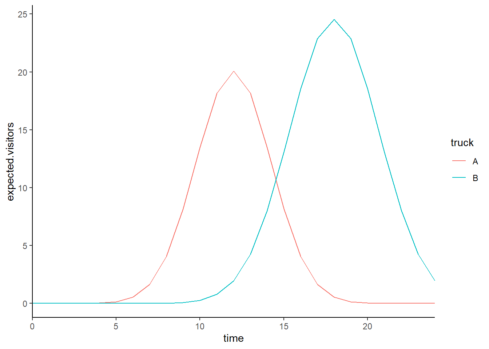
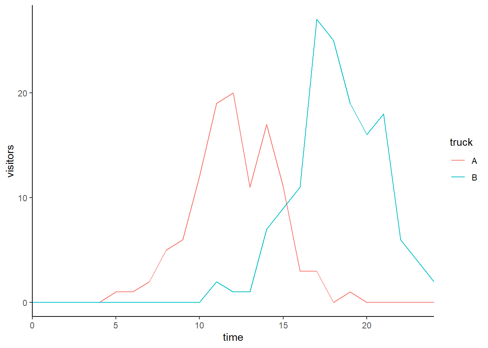

# Error propagation

## Data simulation
For this page, I will simulate some data. The data describes the number of visitors in one of two food trucks (A and B) over time.

``` r
timepoints <- 0:24
trucks <- c('A','B')

df <- expand.grid(time=timepoints,truck=trucks)

df$expected.visitors <- with(df,ifelse(truck=='A',exp(3-0.1*(time-12)^2),exp(3.2-0.07*(time-18)^2)))
```
We now have expected values for each truck at each time point.

``` r
library(ggplot2)
```

```
## Warning: package 'ggplot2' was built under R version 4.2.3
```

``` r
ggplot(df,aes(x=time,y=expected.visitors,col=truck)) + geom_line() + scale_x_continuous(expand=c(0,0)) +theme_classic()
```


From this we can simulate data, by drawing from a poisson distribution. The final data that we will work with, looks like this:

``` r
df$visitors <- rpois(nrow(df),df$expected.visitors)
ggplot(df,aes(x=time,y=visitors,col=truck)) + geom_line() + scale_x_continuous(expand=c(0,0)) +theme_classic()
```



## Problem statement
We proceed with a relatively simple quadratic model fit, to describe the patterns in the data:

``` r
m1 <- glm(visitors~truck*time+truck*I(time^2),data=df,family=poisson)
summary(m1)
```

```
## 
## Call:
## glm(formula = visitors ~ truck * time + truck * I(time^2), family = poisson, 
##     data = df)
## 
## Deviance Residuals: 
##      Min        1Q    Median        3Q       Max  
## -1.51860  -0.37898  -0.04296   0.14487   1.74209  
## 
## Coefficients:
##                    Estimate Std. Error z value Pr(>|z|)    
## (Intercept)       -9.011477   1.595209  -5.649 1.61e-08 ***
## truckB           -13.068856   3.560809  -3.670 0.000242 ***
## time               1.972469   0.266353   7.405 1.31e-13 ***
## I(time^2)         -0.081700   0.010918  -7.483 7.28e-14 ***
## truckB:time        0.788540   0.443230   1.779 0.075227 .  
## truckB:I(time^2)   0.006137   0.014645   0.419 0.675183    
## ---
## Signif. codes:  0 '***' 0.001 '**' 0.01 '*' 0.05 '.' 0.1 ' ' 1
## 
## (Dispersion parameter for poisson family taken to be 1)
## 
##     Null deviance: 490.708  on 49  degrees of freedom
## Residual deviance:  22.575  on 44  degrees of freedom
## AIC: 136.08
## 
## Number of Fisher Scoring iterations: 6
```
For this model, we are interested in the following:
- What is the maximum number of visitors at each truck at any hour.
- When does the maximum number of visitors arrive?
- How are these quantities different for the two trucks
- What is the uncertainty in each of the estimates 1--3.

## Point estimates
Our model prediction ($y$) for a specific truck $i$ at a specific time $t$ is (notation consistent with R):
\begin{equation}
y = e^{\beta_{\text{Intercept}} + \beta_{\text{truckB}} \delta_{i,B} + \beta_{\text{time}}t + \beta_{\text{I(time^2)}}t^2 + \beta_{\text{truckB:time}}\delta_{i,B}t +  \beta_{\text{truckB:I(time^2)}}\delta_{i,B}t^2}
\end{equation}
Here, $\delta_{i,B}$ is equal to 0 when we want to make an estimate for truck A ($i=A$) and 1 when we want to make an estimate for truck B ($i=B$). We now derive expressions for the maximum value and when this occurs. Note that because log transformations are monotonic, we can determine these points on the log scale. Or in other words, we can define a new quantity, $\eta$ which equals $\log{y}$:
\begin{equation}
\eta = \log{y} = {\beta_{\text{Intercept}} + \beta_{\text{truckB}} \delta_{i,B} + \beta_{\text{time}}t + \beta_{\text{I(time^2)}}t^2 + \beta_{\text{truckB:time}}\delta_{i,B}t +  \beta_{\text{truckB:I(time^2)}}\delta_{i,B}t^2}
\end{equation}
whenever $\eta$ is at it's highest possible value, so is $y$. This occurs when $\frac{\text{d}\eta}{\text{d}t}=0$. Hence, when:
\begin{equation}
\frac{\text{d}\eta}{\text{d}t} =  \beta_{\text{time}} + 2\beta_{\text{I(time^2)}}t + \beta_{\text{truckB:time}}\delta_{i,B} +  2\beta_{\text{truckB:I(time^2)}}\delta_{i,B}t=0
\end{equation}
Which can be solved for $t$ relatively easily:
\begin{equation}
t_\text{max} = - \frac{\beta_{\text{time}}+ \beta_{\text{truckB:time}}\delta_{i,B}}{2(\beta_{\text{I(time^2)}} + \beta_{\text{truckB:I(time^2)}}\delta_{i,B})}
\end{equation}
And for specific trucks, in this model we thus find:
\begin{align}
t_\text{max,A} &= - \frac{\beta_{\text{time}}}{2\beta_{\text{I(time^2)}}}\\
t_\text{max,B} &= - \frac{\beta_{\text{time}}+ \beta_{\text{truckB:time}}}{2(\beta_{\text{I(time^2)}} + \beta_{\text{truckB:I(time^2)}})}
\end{align}
The difference in maximum values is thus:
\begin{equation}
\Delta t_\text{max} = \frac{\beta_{\text{time}}+ \beta_{\text{truckB:time}}}{2(\beta_{\text{I(time^2)}} + \beta_{\text{truckB:I(time^2)}})} - \frac{\beta_{\text{time}}}{2\beta_{\text{I(time^2)}}}
\end{equation}
The corresponding maximum values of $\eta$ are then:
\begin{align}
\eta_\text{max,A} &= \beta_{\text{Intercept}} + \beta_{\text{time}} t_\text{max,A} + \beta_{\text{I(time^2)}}t_\text{max,A}^2 \\
\eta_\text{max,B} &= \beta_{\text{Intercept}} + \beta_{\text{truckB}}  + (\beta_{\text{time}}+\beta_{\text{truckB:time}})t_\text{max,B} + (\beta_{\text{I(time^2)}}+\beta_{\text{truckB:I(time^2)}})t_\text{max,B}^2
\end{align}
And the difference is thus:
\begin{equation}
\Delta \eta_\text{max} = \beta_{\text{time}} (t_\text{max,A} - t_\text{max,B})+ \beta_{\text{I(time^2)}}(t_\text{max,A}^2 - t_\text{max,B}^2) -  \beta_{\text{truckB:time}}t_\text{max,B} - \beta_{\text{truckB:I(time^2)}}t_\text{max,B}^2
\end{equation}
For the specific model fit, we end up with (for the time points):

``` r
tmax.a <- -coef(m1)[3]/(2*coef(m1)[4])
tmax.b <- -(coef(m1)[3]+coef(m1)[5])/(2*(coef(m1)[4]+coef(m1)[6]))
Delta.time <- tmax.a-tmax.b
tmax.a
```

```
##     time 
## 12.07143
```

``` r
tmax.b
```

```
##     time 
## 18.26956
```

``` r
tmax.a-tmax.b
```

```
##      time 
## -6.198132
```
These values are close to the time points at which the maximum occurs in the two graphs! The difference between them is negative due to the maximum occurring later for truck B.

The corresponding maxima are then (on the log scale):

``` r
eta.max.a <- coef(m1) %*% c(1,0,tmax.a,tmax.a^2,0,0)
eta.max.b <- coef(m1) %*% c(1,1,tmax.b,tmax.b^2,tmax.b,tmax.b^2)
delta.eta.max <- eta.max.a - eta.max.b
```
And on the response scale, that becomes:

``` r
exp(eta.max.a)
```

```
##          [,1]
## [1,] 18.06151
```

``` r
exp(eta.max.b)
```

```
##          [,1]
## [1,] 23.12415
```

``` r
exp(delta.eta.max)
```

```
##           [,1]
## [1,] 0.7810669
```
Note here that the last number corresponds to the ratio between the first two.


## Uncertainty using sampling
Probably the easiest way to get some view of the uncertainty, is by sampling parameters.

``` r
library(mvtnorm)
samples <- rmvnorm(1e5,coef(m1),vcov(m1)) # we draw 1e6 different parameter combinations

# for each combination we calculate tmax values:
tmax.as <- -samples[,3]/(2*samples[,4])
tmax.bs <- -(samples[,3]+samples[,5])/(2*(samples[,4]+samples[,6]))
delta.tmaxs <- tmax.as - tmax.bs

# confints:
quantile(tmax.as,probs=c(0.025,0.975))
```

```
##     2.5%    97.5% 
## 11.59691 12.54606
```

``` r
quantile(tmax.bs,probs=c(0.025,0.975))
```

```
##     2.5%    97.5% 
## 17.84223 18.72235
```

``` r
quantile(delta.tmaxs,probs=c(0.025,0.975))
```

```
##      2.5%     97.5% 
## -6.850810 -5.562397
```

``` r
# we can do the same for eta max:
eta.max.as <- samples[,1] + samples[,3] * tmax.as + samples[,4] * tmax.as^2
eta.max.bs <- samples[,1] + samples[,2] + (samples[,3]+samples[,5]) * tmax.bs + (samples[,4]+samples[,6]) * tmax.bs^2
delta.maxs <- eta.max.as - eta.max.bs

# confints:
quantile(eta.max.as,probs=c(0.025,0.975))
```

```
##     2.5%    97.5% 
## 2.671837 3.124145
```

``` r
quantile(eta.max.bs,probs=c(0.025,0.975))
```

```
##     2.5%    97.5% 
## 2.943406 3.345159
```

``` r
quantile(delta.maxs,probs=c(0.025,0.975))
```

```
##        2.5%       97.5% 
## -0.54893785  0.05755216
```

``` r
# on the response scale:
quantile(exp(eta.max.as),probs=c(0.025,0.975))
```

```
##     2.5%    97.5% 
## 14.46653 22.74044
```

``` r
quantile(exp(eta.max.bs),probs=c(0.025,0.975))
```

```
##     2.5%    97.5% 
## 18.98038 28.36507
```

``` r
quantile(exp(delta.maxs),probs=c(0.025,0.975))
```

```
##      2.5%     97.5% 
## 0.5775629 1.0592405
```
## Uncertainty using delta method
Now, we will approximate the 95% CIs using the delta method. This method is very nicely described by @deltamethod . Recall the expression for the time at which the maximum occurs for truck A:
\begin{equation}
\hat{t_\text{max,A}} = - \frac{\beta_{\text{time}}}{2\beta_{\text{I(time^2)}}}
\end{equation}
For the delta method, we need to find the set of partial derivatives of $\hat{t_\text{max,A}}$ with respect to each of the model parameters:
\begin{align}
\frac{\partial \hat{t_\text{max,A}}}{\partial \beta_{\text{Intercept}}} &= 0\\
\frac{\partial \hat{t_\text{max,A}}}{\partial \beta_{\text{truckB}}} &= 0\\
\frac{\partial \hat{t_\text{max,A}}}{\partial \beta_{\text{time}}} &=  - \frac{1}{2\beta_{\text{I(time^2)}}}\\
\frac{\partial \hat{t_\text{max,A}}}{\partial \beta_{\text{I(time^2)}}} &= \frac{\beta_{\text{time}}}{2\beta_{\text{I(time^2)}}^2}\\
\frac{\partial \hat{t_\text{max,A}}}{\partial \beta_{\text{truckB:time}}} &= 0\\

\frac{\partial \hat{t_\text{max,A}}}{\partial \beta_{\text{truckB:I(time^2)}}} &= 0\\


\end{align}
In slightly shorter notation, we can write:
\begin{equation}
\nabla \hat{t_\text{max,A}} = \begin{bmatrix} 0 \\ 0 \\ - \frac{1}{2\beta_{\text{I(time^2)}}} \\  \frac{\beta_{\text{time}}}{2\beta_{\text{I(time^2)}}^2} \\ 0 \\ 0 \end{bmatrix}
\end{equation}
We can get to the uncertainty using this expression together with the variance covariance matrix ($\Sigma$):
\begin{equation}
\text{Var}(\hat{t_\text{max,A}}) = \nabla \hat{t_\text{max,A}}^\text{T} \cdot \Sigma \cdot \nabla \hat{t_\text{max,A}}
\end{equation}
We can take the square root of this variance to obtain the standard error, and then approximate the 95% CI using this standard error. In R notation:

``` r
vcv <- vcov(m1) # get vcv
derivs <- c(0,0,-1/(2*coef(m1)[4]), coef(m1)[3]/(2*coef(m1)[4]^2),0,0) # gradient

# uncertainty (variance):
var.tmax.a <- as.numeric(derivs%*% vcv %*% derivs)
se.tmax.a <- sqrt(var.tmax.a)

# 95% CI:
tmax.a.CI <- tmax.a + qnorm(c(0.025,0.975))*se.tmax.a
tmax.a.CI
```

```
## [1] 11.61327 12.52959
```

``` r
# compare to the sampling 95% CI:
quantile(tmax.as,probs=c(0.025,0.975))
```

```
##     2.5%    97.5% 
## 11.59691 12.54606
```
We can calculate the CI for $t_\text{max,B}$ anaogously:
\begin{equation}
\nabla \hat{t_\text{max,B}} = \begin{bmatrix} 0 \\ 0 \\ 
- \frac{1}{2(\beta_{\text{I(time^2)}}+\beta_{\text{truckB:I(time^2)}})} \\  
\frac{\beta_{\text{time}}+\beta_{\text{truckB:time}}}{2(\beta_{\text{I(time^2)}}+\beta_{\text{truckB:I(time^2)}})^2} \\ - \frac{1}{2(\beta_{\text{I(time^2)}}+\beta_{\text{truckB:I(time^2)}})} \\ \frac{\beta_{\text{time}}+\beta_{\text{truckB:time}}}{2(\beta_{\text{I(time^2)}}+\beta_{\text{truckB:I(time^2)}})^2}
\end{bmatrix}
\end{equation}
and:
\begin{equation}
\text{Var}(\hat{t_\text{max,B}}) = \nabla \hat{t_\text{max,B}}^\text{T} \cdot \Sigma \cdot \nabla \hat{t_\text{max,B}}
\end{equation}
From here it is then straightforward to calculate the standard error and 95% CI.

``` r
vcv <- vcov(m1) # get vcv
derivs <- c(0,0,-1/(2*(coef(m1)[4]+coef(m1)[6])), (coef(m1)[3]+coef(m1)[5])/(2*(coef(m1)[4]+coef(m1)[6])^2),-1/(2*(coef(m1)[4]+coef(m1)[6])),(coef(m1)[3]+coef(m1)[5])/(2*(coef(m1)[4]+coef(m1)[6])^2)) # gradient

# uncertainty (variance):
var.tmax.b <- as.numeric(derivs%*% vcv %*% derivs)
se.tmax.b <- sqrt(var.tmax.b)

# 95% CI:
tmax.b.CI <- tmax.b + qnorm(c(0.025,0.975))*se.tmax.b
tmax.b.CI
```

```
## [1] 17.84113 18.69799
```

``` r
# compare to the sampling 95% CI:
quantile(tmax.bs,probs=c(0.025,0.975))
```

```
##     2.5%    97.5% 
## 17.84223 18.72235
```
Next, we can do the same for the difference in time. We take a shortcut now, in the sense that we let R calculate the derivatives for us, using the Deriv library.

``` r
library(Deriv)
```

```
## Warning: package 'Deriv' was built under R version 4.2.1
```

``` r
# we define a function that calculates delta t max:
delta.t.max.fun <- function(beta.0,beta.B,beta.time,beta.Bxtime,beta.time2,beta.Bxtime2){
  (beta.time + beta.Bxtime)/(2*(beta.time2+beta.Bxtime2)) - beta.time/(2*beta.time2)
}
# below, for each of the coefficients, a function for the derivative is dermined and that function is evaluated:
derivs <- sapply(c("beta.0","beta.B","beta.time","beta.time2","beta.Bxtime","beta.Bxtime2"), FUN = function(x){ 
  derfun <- Deriv(delta.t.max.fun,x)
  derfun(beta.0=coef(m1)[1],beta.B=coef(m1)[2],
         beta.time=coef(m1)[3],beta.time2=coef(m1)[4],
         beta.Bxtime=coef(m1)[5],beta.Bxtime2=coef(m1)[6])
  })
Deriv(delta.t.max.fun,"beta.time")
```

```
## function (beta.0, beta.B, beta.time, beta.Bxtime, beta.time2, 
##     beta.Bxtime2) 
## 1/(2 * (beta.Bxtime2 + beta.time2)) - 1/(2 * beta.time2)
```

``` r
# In a similar fashion as before, we can no proceed and calculate the 95% CI:
# uncertainty (variance):
var.delta.tmax <- as.numeric(derivs%*% vcv %*% derivs)
se.delta.tmax <- sqrt(var.delta.tmax)

# 95% CI:
tmax.delta.CI <- (tmax.a-tmax.b) + qnorm(c(0.025,0.975))*se.delta.tmax
tmax.delta.CI
```

```
## [1] -6.825394 -5.570869
```

``` r
# compare to the sampling 95% CI:
quantile(delta.tmaxs,probs=c(0.025,0.975))
```

```
##      2.5%     97.5% 
## -6.850810 -5.562397
```
Again close enough!

We proceed in a similar fashion for the maximum values, first defining appropriate functions and then using the machinery from above to calculate CIs:

``` r
eta.max.a.fun <- function(beta.0,beta.B,beta.time,beta.Bxtime,beta.time2,beta.Bxtime2){
  tmax.a <- - beta.time/(2*beta.time2)
  beta.0 + beta.time*tmax.a + beta.time2*tmax.a^2
}

eta.max.b.fun <- function(beta.0,beta.B,beta.time,beta.Bxtime,beta.time2,beta.Bxtime2){
  tmax.b <- - (beta.time+beta.Bxtime)/(2*(beta.time2+beta.Bxtime2))
  beta.0 + beta.B + (beta.time+beta.Bxtime)*tmax.b + (beta.time2+beta.Bxtime2)*tmax.b^2
}

delta.eta.max.fun <- function(beta.0,beta.B,beta.time,beta.Bxtime,beta.time2,beta.Bxtime2){
  tmax.a <- - beta.time/(2*beta.time2)
  tmax.b <- - (beta.time+beta.Bxtime)/(2*(beta.time2+beta.Bxtime2))
  eta.max.a <- beta.0 + beta.time*tmax.a + beta.time2*tmax.a^2
  eta.max.b <- beta.0 + beta.B + (beta.time+beta.Bxtime)*tmax.b + (beta.time2+beta.Bxtime2)*tmax.b^2
  eta.max.a - eta.max.b
}

calc.CI <- function(mod,func){
  expval <- func(beta.0=coef(mod)[1],beta.B=coef(mod)[2],
         beta.time=coef(mod)[3],beta.time2=coef(mod)[4],
         beta.Bxtime=coef(mod)[5],beta.Bxtime2=coef(mod)[6])

  terms <- c("beta.0","beta.B","beta.time","beta.time2","beta.Bxtime","beta.Bxtime2")
  derivs <- rep(0,length(terms))
  for(i in 1:length(terms)){
  derfun <- Deriv(func,terms[i])
  derivs[i] <- derfun(beta.0=coef(mod)[1],beta.B=coef(mod)[2],
         beta.time=coef(mod)[3],beta.time2=coef(mod)[4],
         beta.Bxtime=coef(mod)[5],beta.Bxtime2=coef(mod)[6])
  }
  vcv <- vcov(mod)
  var.val <- as.numeric(derivs%*% vcv %*% derivs)
  se.val <- sqrt(var.val)

# 95% CI:
  expval + qnorm(c(0.025,0.975))*se.val
}

# CI for eta.max.a:
calc.CI(m1,eta.max.a.fun)
```

```
## [1] 2.666957 3.120609
```

``` r
# compare to the sampling 95% CI:
quantile(eta.max.as,probs=c(0.025,0.975))
```

```
##     2.5%    97.5% 
## 2.671837 3.124145
```

``` r
# CI for eta.max.b:
calc.CI(m1,eta.max.b.fun)
```

```
## [1] 2.940117 3.341638
```

``` r
# compare to the sampling 95% CI:
quantile(eta.max.bs,probs=c(0.025,0.975))
```

```
##     2.5%    97.5% 
## 2.943406 3.345159
```

``` r
## CI for the difference:
# CI for eta.max.b:
calc.CI(m1,delta.eta.max.fun)
```

```
## [1] -0.55000518  0.05581633
```

``` r
# compare to the sampling 95% CI:
quantile(delta.maxs,probs=c(0.025,0.975))
```

```
##        2.5%       97.5% 
## -0.54893785  0.05755216
```
```

## Conclusion

The sampling and delta method gave near identical results. We conclude that for the fitted model, the maximum number of visitors at truck A occurs at 12.1 with a 95% CI of [11.61, 12.53] and for truck B at time 18.3 with a 95% CI of [17.84, 18.7]. The difference in timing of the maxima between the two trucks is -6.2 with a 95% CI of [-6.83, -5.57]. Here, negative numbers indicate that the maximum occurred first in truck A.

The maximum values themselves on the log scale were for truck A 2.89 with a 95% CI of [2.67, 3.12] and for truck B  3.14 with a 95% CI of [2.94, 3.34]. The difference in between maxima between the two trucks is -0.25 with a 95% CI of [-0.55, 0.06]. Here, negative values would indicate that truck B has a higher maximum than truck A.

On the observable scale (i.e. actual counts), the highest number of visitors at truck A was 18.06 with a 95% CI of [14.4, 22.66] and for truck B 23.12 with a 95% CI of [18.92, 28.27]. The relative difference between the maximum number of visitors between the two trucks was 0.78 with a 95% CI of [0.58, 1.06]. This means that the maximum number of visitors for truck A was 0.78 x the maximum number of visitors for truck B.

