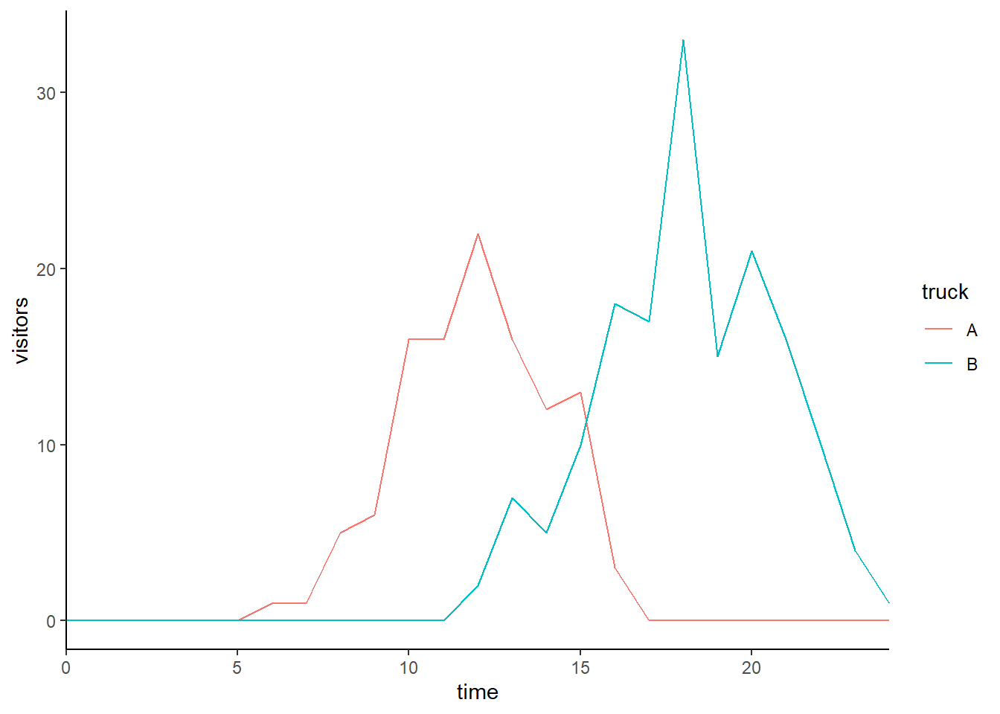

# Error propagation

## Data simulation
For this page, I will simulate some data. The data describes the number of visitors in one of two food trucks (A and B) over time.

``` r
timepoints <- 0:24
trucks <- c('A','B')

df <- expand.grid(time=timepoints,truck=trucks)

df$expected.visitors <- with(df,ifelse(truck=='A',exp(3-0.1*(time-12)^2),exp(3.2-0.07*(time-18)^2)))
```
We now have expected values for each truck at each time point.

``` r
library(ggplot2)
```

```
## Warning: package 'ggplot2' was built under R version 4.2.3
```

``` r
ggplot(df,aes(x=time,y=expected.visitors,col=truck)) + geom_line() + scale_x_continuous(expand=c(0,0)) +theme_classic()
```


From this we can simulate data, by drawing from a poisson distribution. The final data that we will work with, looks like this:

``` r
df$visitors <- rpois(nrow(df),df$expected.visitors)
ggplot(df,aes(x=time,y=visitors,col=truck)) + geom_line() + scale_x_continuous(expand=c(0,0)) +theme_classic()
```



## Problem statement
We proceed with a relatively simple quadratic model fit, to describe the patterns in the data:

``` r
m1 <- glm(visitors~truck*time+truck*I(time^2),data=df,family=poisson)
summary(m1)
```

```
## 
## Call:
## glm(formula = visitors ~ truck * time + truck * I(time^2), family = poisson, 
##     data = df)
## 
## Deviance Residuals: 
##      Min        1Q    Median        3Q       Max  
## -2.78413  -0.22926  -0.01001   0.14095   2.11727  
## 
## Coefficients:
##                   Estimate Std. Error z value Pr(>|z|)    
## (Intercept)      -17.11303    2.72374  -6.283 3.32e-10 ***
## truckB            -3.56256    3.92317  -0.908  0.36384    
## time               3.38900    0.45771   7.404 1.32e-13 ***
## I(time^2)         -0.14163    0.01901  -7.450 9.35e-14 ***
## truckB:time       -0.73282    0.55759  -1.314  0.18876    
## truckB:I(time^2)   0.06789    0.02099   3.235  0.00122 ** 
## ---
## Signif. codes:  0 '***' 0.001 '**' 0.01 '*' 0.05 '.' 0.1 ' ' 1
## 
## (Dispersion parameter for poisson family taken to be 1)
## 
##     Null deviance: 597.287  on 49  degrees of freedom
## Residual deviance:  37.559  on 44  degrees of freedom
## AIC: 143.97
## 
## Number of Fisher Scoring iterations: 7
```
For this model, we are interested in the following:
1. What is the maximum number of visitors at each truck at any hour.
2. When does the maximum number of visitors arrive?
3. How are these quantities different for the two trucks
4. What is the uncertainty in each of the estimates 1--3.

## Point estimates
Our model prediction ($y$) for a specific truck $i$ at a specific time $t$ is (notation consistent with R):
\begin{equation}
y = e^{\beta_{\text{Intercept}} + \beta_{\text{truckB}} \delta_{i,B} + \beta_{\text{time}}t + \beta_{\text{I(time^2)}}t^2 + \beta_{\text{truckB:time}}\delta_{i,B}t +  \beta_{\text{truckB:I(time^2)}}\delta_{i,B}t^2}
\end{equation}
Here, $\delta_{i,B}$ is equal to 0 when we want to make an estimate for truck A ($i=A$) and 1 when we want to make an estimate for truck B ($i=B$). We now derive expressions for the maximum value and when this occurs. Note that because log transformations are monotonic, we can determine these points on the log scale. Or in other words, we can define a new quantity, $\eta$ which equals $\log{y}$:
\begin{equation}
\eta = \log{y} = {\beta_{\text{Intercept}} + \beta_{\text{truckB}} \delta_{i,B} + \beta_{\text{time}}t + \beta_{\text{I(time^2)}}t^2 + \beta_{\text{truckB:time}}\delta_{i,B}t +  \beta_{\text{truckB:I(time^2)}}\delta_{i,B}t^2}
\end{equation}
whenever $\eta$ is at it's highest possible value, so is $y$. This occurs when $\frac{\text{d}\eta}{\text{d}t}=0$. Hence, when:
\begin{equation}
\frac{\text{d}\eta}{\text{d}t} =  \beta_{\text{time}} + 2\beta_{\text{I(time^2)}}t + \beta_{\text{truckB:time}}\delta_{i,B} +  2\beta_{\text{truckB:I(time^2)}}\delta_{i,B}t=0
\end{equation}
Which can be solved for $t$ relatively easily:
\begin{equation}
t_\text{max} = - \frac{\beta_{\text{time}}+ \beta_{\text{truckB:time}}\delta_{i,B}}{2(\beta_{\text{I(time^2)}} + \beta_{\text{truckB:I(time^2)}}\delta_{i,B})}
\end{equation}
And for specific trucks, in this model we thus find:
\begin{align}
t_\text{max,A} &= - \frac{\beta_{\text{time}}}{2\beta_{\text{I(time^2)}}}\\
t_\text{max,B} &= - \frac{\beta_{\text{time}}+ \beta_{\text{truckB:time}}}{2(\beta_{\text{I(time^2)}} + \beta_{\text{truckB:I(time^2)}})}
\end{align}
The difference in maximum values is thus:
\begin{equation}
\Delta t_\text{max} = \frac{\beta_{\text{time}}+ \beta_{\text{truckB:time}}}{2(\beta_{\text{I(time^2)}} + \beta_{\text{truckB:I(time^2)}})} - \frac{\beta_{\text{time}}}{2\beta_{\text{I(time^2)}}}
\end{equation}
The corresponding maximum values of $\eta$ are then:
\begin{align}
\eta_\text{max,A} &= \beta_{\text{Intercept}} + \beta_{\text{time}} t_\text{max,A} + \beta_{\text{I(time^2)}}t_\text{max,A}^2 \\
\eta_\text{max,B} &= \beta_{\text{Intercept}} + \beta_{\text{truckB}}  + (\beta_{\text{time}}+\beta_{\text{truckB:time}})t_\text{max,B} + (\beta_{\text{I(time^2)}}+\beta_{\text{truckB:I(time^2)}})t_\text{max,B}^2
\end{align}
And the difference is thus:
\begin{equation}
\Delta \eta_\text{max} = \beta_{\text{time}} (t_\text{max,A} - t_\text{max,B})+ \beta_{\text{I(time^2)}}(t_\text{max,A}^2 - t_\text{max,B}^2) -  \beta_{\text{truckB:time}}t_\text{max,B} - \beta_{\text{truckB:I(time^2)}}t_\text{max,B}^2
\end{equation}
For the specific model fit, we end up with (for the time points):

``` r
tmax.a <- -coef(m1)[3]/(2*coef(m1)[4])
tmax.b <- -(coef(m1)[3]+coef(m1)[5])/(2*(coef(m1)[4]+coef(m1)[6]))
Delta.time <- tmax.a-tmax.b
tmax.a
```

```
##     time 
## 11.96396
```

``` r
tmax.b
```

```
##     time 
## 18.00912
```

``` r
tmax.a-tmax.b
```

```
##      time 
## -6.045152
```
These values are close to the time points at which the maximum occurs in the two graphs! The difference between them is negative due to the maximum occurring later for truck B.

The corresponding maxima are then (on the log scale):

``` r
eta.max.a <- coef(m1) %*% c(1,0,tmax.a,tmax.a^2,0,0)
eta.max.b <- coef(m1) %*% c(1,1,tmax.b,tmax.b^2,tmax.b,tmax.b^2)
delta.eta.max <- eta.max.a - eta.max.b
```
And on the response scale, that becomes:

``` r
exp(eta.max.a)
```

```
##          [,1]
## [1,] 23.56847
```

``` r
exp(eta.max.b)
```

```
##          [,1]
## [1,] 25.58845
```

``` r
exp(delta.eta.max)
```

```
##          [,1]
## [1,] 0.921059
```
Note here that the last number corresponds to the ratio between the first two.


## Uncertainty using sampling
Probably the easiest way to get some view of the uncertainty, is by sampling parameters.

``` r
library(mvtnorm)
samples <- rmvnorm(1e5,coef(m1),vcov(m1)) # we draw 1e6 different parameter combinations

# for each combination we calculate tmax values:
tmax.as <- -samples[,3]/(2*samples[,4])
tmax.bs <- -(samples[,3]+samples[,5])/(2*(samples[,4]+samples[,6]))
delta.tmaxs <- tmax.as - tmax.bs

# confints:
quantile(tmax.as,probs=c(0.025,0.975))
```

```
##     2.5%    97.5% 
## 11.60128 12.32642
```

``` r
quantile(tmax.bs,probs=c(0.025,0.975))
```

```
##     2.5%    97.5% 
## 17.59941 18.44028
```

``` r
quantile(delta.tmaxs,probs=c(0.025,0.975))
```

```
##      2.5%     97.5% 
## -6.603466 -5.501105
```

``` r
# we can do the same for eta max:
eta.max.as <- samples[,1] + samples[,3] * tmax.as + samples[,4] * tmax.as^2
eta.max.bs <- samples[,1] + samples[,2] + (samples[,3]+samples[,5]) * tmax.as + (samples[,4]+samples[,6]) * tmax.as^2
delta.maxs <- eta.max.as - eta.max.bs

# confints:
quantile(eta.max.as,probs=c(0.025,0.975))
```

```
##     2.5%    97.5% 
## 2.935919 3.392729
```

``` r
quantile(eta.max.bs,probs=c(0.025,0.975))
```

```
##       2.5%      97.5% 
## -0.1790268  1.2224574
```

``` r
quantile(delta.maxs,probs=c(0.025,0.975))
```

```
##     2.5%    97.5% 
## 1.897380 3.376007
```

``` r
# on the response scale:
quantile(exp(eta.max.as),probs=c(0.025,0.975))
```

```
##     2.5%    97.5% 
## 18.83881 29.74703
```

``` r
quantile(exp(eta.max.bs),probs=c(0.025,0.975))
```

```
##      2.5%     97.5% 
## 0.8360835 3.3955215
```

``` r
quantile(exp(delta.maxs),probs=c(0.025,0.975))
```

```
##     2.5%    97.5% 
##  6.66840 29.25373
```
## Uncertainty using delta method
Now, we will approximate the 95% CIs using the delta method. This method is very nicely described by @deltamethod . Recall the expression for the time at which the maximum occurs for truck A:
\begin{equation}
\hat{t_\text{max,A}} = - \frac{\beta_{\text{time}}}{2\beta_{\text{I(time^2)}}}
\end{equation}
For the delta method, we need to find the set of partial derivatives of $\hat{t_\text{max,A}}$ with respect to each of the model parameters:
\begin{align}
\frac{\partial \hat{t_\text{max,A}}}{\partial \beta_{\text{Intercept}}} &= 0\\
\frac{\partial \hat{t_\text{max,A}}}{\partial \beta_{\text{truckB}}} &= 0\\
\frac{\partial \hat{t_\text{max,A}}}{\partial \beta_{\text{time}}} &=  - \frac{1}{2\beta_{\text{I(time^2)}}}\\
\frac{\partial \hat{t_\text{max,A}}}{\partial \beta_{\text{I(time^2)}}} &= \frac{\beta_{\text{time}}}{2\beta_{\text{I(time^2)}}^2}\\
\frac{\partial \hat{t_\text{max,A}}}{\partial \beta_{\text{truckB:time}}} &= 0\\

\frac{\partial \hat{t_\text{max,A}}}{\partial \beta_{\text{truckB:I(time^2)}}} &= 0\\


\end{align}
In slightly shorter notation, we can write:
\begin{equation}
\nabla \hat{t_\text{max,A}} = \begin{bmatrix} 0 \\ 0 \\ - \frac{1}{2\beta_{\text{I(time^2)}}} \\  \frac{\beta_{\text{time}}}{2\beta_{\text{I(time^2)}}^2} \\ 0 \\ 0 \end{bmatrix}
\end{equation}
We can get to the uncertainty using this expression together with the variance covariance matrix ($\Sigma$):
\begin{equation}
\text{Var}(\hat{t_\text{max,A}}) = \nabla \hat{t_\text{max,A}}^\text{T} \cdot \Sigma \cdot \nabla \hat{t_\text{max,A}}
\end{equation}
We can take the square root of this variance to obtain the standard error, and then approximate the 95% CI using this standard error. In R notation:

``` r
vcv <- vcov(m1) # get vcv
derivs <- c(0,0,-1/(2*coef(m1)[4]), coef(m1)[3]/(2*coef(m1)[4]^2),0,0) # gradient

# uncertainty (variance):
var.tmax.a <- as.numeric(derivs%*% vcv %*% derivs)
se.tmax.a <- sqrt(var.tmax.a)

# 95% CI:
tmax.a + qnorm(c(0.025,0.975))*se.tmax.a
```

```
## [1] 11.61443 12.31350
```

``` r
# compare to the sampling 95% CI:
quantile(tmax.as,probs=c(0.025,0.975))
```

```
##     2.5%    97.5% 
## 11.60128 12.32642
```
